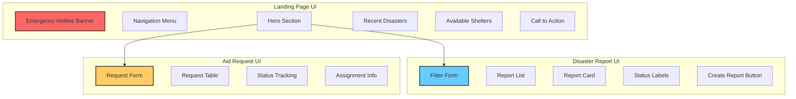

# DRIS (Disaster Response Information System) Project Documentation

**Student Name:** Your Name  
**Student ID:** Your Student ID  
**Framework:** Django Web Framework  
**UI Framework:** Semantic UI CSS  

## Table of Contents
1. [Project Overview](#project-overview)
2. [Data Model Design](#data-model-design)
3. [System Architecture](#system-architecture)
4. [User Interface Design](#user-interface-design)
5. [Navigation Flow](#navigation-flow)
6. [Implementation Details](#implementation-details)
7. [Security Features](#security-features)
8. [Installation Guide](#installation-guide)
9. [User Roles and Permissions](#user-roles-and-permissions)

## Project Overview

The Disaster Response Information System (DRIS) is a centralized web-based platform developed for the National Disaster Management Agency (NADMA) to improve coordination and communication during disasters in Malaysia. The system facilitates interaction between three main user groups:

- **Citizens**: Report disasters and request aid
- **Volunteers**: Register availability and assist in emergencies
- **Authorities**: Monitor, manage, and coordinate disaster response

## Data Model Design

### Entity Relationship Diagram

The DRIS data model consists of five main entities with the following relationships:

### 1. User (Extended with UserProfile)
- **Fields:**
  - username (CharField)
  - email (EmailField)
  - first_name (CharField)
  - last_name (CharField)
  - password (CharField)
  - date_joined (DateTimeField)

### 2. UserProfile
- **Fields:**
  - user (OneToOneField to User)
  - role (CharField: citizen/volunteer/authority)
  - skills (TextField) - for volunteers
  - availability (BooleanField) - for volunteers
  - created_at (DateTimeField)
  - updated_at (DateTimeField)
- **Relationships:**
  - One-to-One with User

### 3. DisasterReport
- **Fields:**
  - reporter (ForeignKey to User)
  - disaster_type (CharField: flood/fire/earthquake/landslide/haze/other)
  - severity (CharField: low/medium/high/critical)
  - location (CharField)
  - gps_coordinates (CharField)
  - description (TextField)
  - timestamp (DateTimeField)
  - is_verified (BooleanField)
  - created_at (DateTimeField)
  - updated_at (DateTimeField)
- **Relationships:**
  - Many-to-One with User (reporter)

### 4. Shelter
- **Fields:**
  - name (CharField)
  - location (CharField)
  - capacity (IntegerField)
  - current_occupancy (IntegerField)
  - available_spaces (IntegerField - calculated)
  - facilities (TextField)
  - contact_person (CharField)
  - contact_number (CharField)
  - is_active (BooleanField)
  - created_at (DateTimeField)
  - updated_at (DateTimeField)

### 5. AidRequest
- **Fields:**
  - requester (ForeignKey to User)
  - request_type (CharField: food/water/shelter/medical/clothing/rescue/other)
  - description (TextField)
  - location (CharField)
  - urgency_level (CharField: low/medium/high/critical)
  - number_of_people (IntegerField)
  - status (CharField: pending/assigned/in_progress/completed/cancelled)
  - assigned_shelter (ForeignKey to Shelter, nullable)
  - created_at (DateTimeField)
  - updated_at (DateTimeField)
- **Relationships:**
  - Many-to-One with User (requester)
  - Many-to-One with Shelter (optional)

### 6. VolunteerAssignment
- **Fields:**
  - volunteer (ForeignKey to User)
  - aid_request (ForeignKey to AidRequest)
  - assigned_by (ForeignKey to User)
  - task_description (TextField)
  - status (CharField: assigned/accepted/in_progress/completed/cancelled)
  - assigned_at (DateTimeField)
  - completed_at (DateTimeField, nullable)
- **Relationships:**
  - Many-to-One with User (volunteer)
  - Many-to-One with AidRequest
  - Many-to-One with User (assigned_by)

## System Architecture

The DRIS follows the Model-View-Template (MVT) architecture pattern:

### Models
- Define data structure and business logic
- Handle database interactions
- Implement data validation

### Views
- Process HTTP requests
- Implement business logic
- Handle form processing
- Manage user authentication and authorization

### Templates
- Render dynamic HTML content
- Implement Semantic UI components
- Handle user interface presentation

## User Interface Design




### Base Template Structure
The base template (`base.html`) includes:
- **Header**: Emergency hotline banner (999, NADMA: 03-8064 2400)
- **Navigation**: Dynamic menu based on user role
- **Content Area**: Main content section
- **Footer**: Links and copyright information

### Key Templates

1. **Home Page** (`home.html`)
   - Hero section with quick action cards
   - Recent disaster reports
   - Available shelters
   - Call-to-action sections

2. **Disaster Reports** (`disaster_reports.html`)
   - Filter form (type, severity, location, date range)
   - List view with icons and status indicators
   - Detailed information display

3. **Create Disaster Report** (`create_disaster_report.html`)
   - Form with disaster type, severity, location
   - GPS coordinate capture
   - Description field
   - Warning messages

4. **Shelters** (`shelters.html`)
   - Search functionality
   - Card-based layout
   - Real-time availability display
   - Contact information and directions

5. **Aid Requests** (`aid_requests.html`)
   - Role-based view (citizen/volunteer/authority)
   - Table layout with status indicators
   - Action buttons for authorities

6. **Volunteer Dashboard** (`volunteer_dashboard.html`)
   - Statistics overview
   - Pending requests table
   - Available volunteers cards
   - Recent assignments history

## Navigation Flow

The navigation flow varies based on user role:

### Citizens
1. Register/Login → Home
2. Home → Report Disaster
3. Home → Request Aid
4. Home → View Shelters
5. Profile → View My Reports/Requests

### Volunteers
1. Register/Login → Home
2. Profile → Update Skills/Availability
3. Aid Requests → View Assigned Tasks
4. Home → View Disaster Reports/Shelters

### Authorities
1. Login → Home
2. Volunteer Dashboard → Manage Assignments
3. Aid Requests → Assign Volunteers
4. Admin Panel → Manage All Data

## Implementation Details

### Key Features Implemented

1. **User Management**
   - Role-based registration
   - Secure authentication
   - Profile management

2. **Disaster Reporting**
   - Multi-field form with validation
   - GPS coordinate support
   - Severity classification

3. **Aid Request Management**
   - Request submission for citizens
   - Status tracking
   - Volunteer assignment

4. **Volunteer Coordination**
   - Skill registration
   - Availability toggle
   - Task assignment tracking

5. **Shelter Directory**
   - Real-time availability
   - Search functionality
   - Contact integration

6. **Administrative Dashboard**
   - User management
   - Report verification
   - Assignment oversight

## Security Features

1. **Authentication**
   - Django's built-in authentication system
   - Password validation rules
   - Session management

2. **Authorization**
   - Role-based access control
   - View-level permissions
   - Form validation

3. **Data Protection**
   - CSRF protection
   - SQL injection prevention
   - XSS protection

## Installation Guide

### Prerequisites
- Python 3.8+
- Django 4.2+
- SQLite (default) or PostgreSQL/MySQL

### Setup Steps

1. **Clone the repository**
   ```bash
   git clone [repository-url]
   cd DRIS_Project
   ```

2. **Create virtual environment**
   ```bash
   python -m venv venv
   source venv/bin/activate  # On Windows: venv\Scripts\activate
   ```

3. **Install dependencies**
   ```bash
   pip install django
   ```

4. **Run migrations**
   ```bash
   python manage.py makemigrations
   python manage.py migrate
   ```

5. **Create superuser**
   ```bash
   python manage.py createsuperuser
   ```

6. **Run development server**
   ```bash
   python manage.py runserver
   ```

7. **Access the application**
   - Main site: http://localhost:8000
   - Admin panel: http://localhost:8000/admin

## User Roles and Permissions

### Citizen
- Create disaster reports
- Submit aid requests
- View all public information
- Manage own profile

### Volunteer
- View assigned tasks
- Update availability status
- Register skills
- Access disaster/shelter information

### Authority
- Access volunteer dashboard
- Assign volunteers to requests
- View all system data
- Manage users through admin panel

## Modular Architecture

The application follows a modular design:

1. **Reusable Components**
   - Base template for consistent UI
   - Form classes for data validation
   - Model methods for business logic

2. **Separation of Concerns**
   - Models handle data
   - Views process requests
   - Templates present information

3. **Extensibility**
   - Easy to add new disaster types
   - Flexible user role system
   - Modular template structure

## Future Enhancements

1. Real-time notifications
2. Mobile application
3. SMS/Email alerts
4. Advanced mapping features
5. Resource tracking
6. Multi-language support

---

**Note:** This system is designed for educational purposes. In production, additional security measures, performance optimization, and compliance with data protection regulations would be required. 
