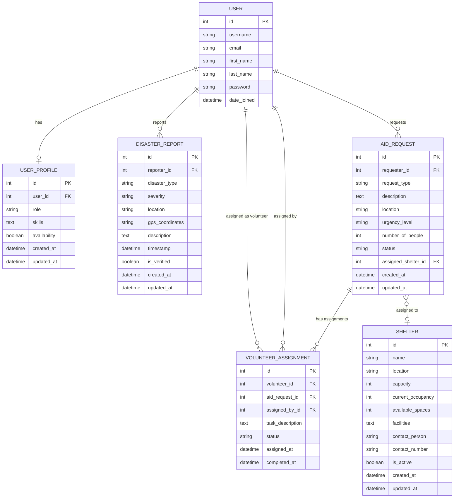
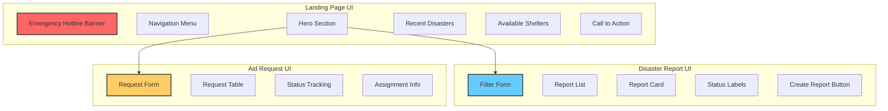
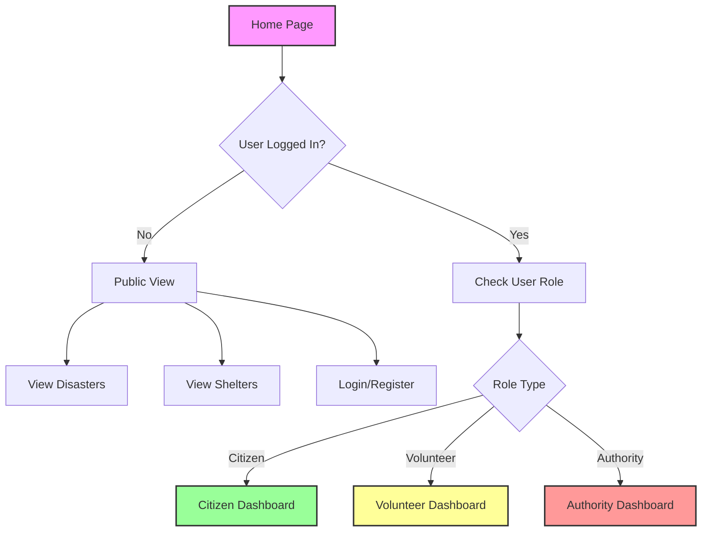
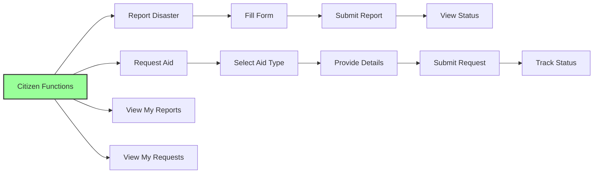
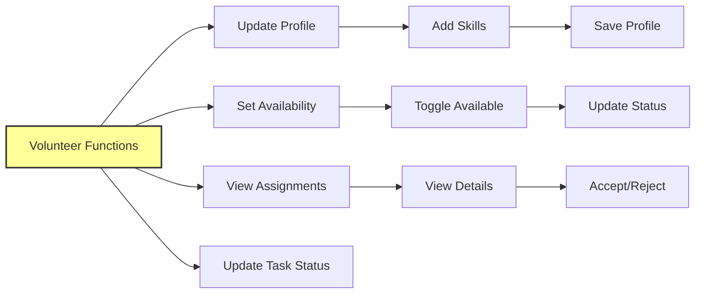
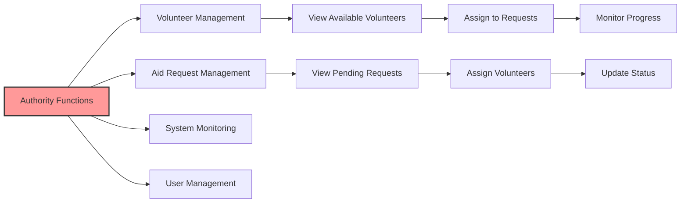

# DRIS (Disaster Response Information System) Project Documentation

**Student Name:** DU WENTAO  
**Student ID:** 24084310  
**Framework:** Django Web Framework  
**UI Framework:** Semantic UI CSS  
**Database:** SQLite  
**Architecture:** MVC  

## Table of Contents
1. [Project Overview](#project-overview)
2. [Data Model Design](#data-model-design)
3. [System Architecture](#system-architecture)
4. [User Interface Design](#user-interface-design)
5. [Navigation Flow](#navigation-flow)
6. [UI Flow Diagrams](#ui-flow-diagrams)
7. [Implementation Details](#implementation-details)
8. [Security Features](#security-features)
9. [Installation Guide](#installation-guide)
10. [User Roles and Permissions](#user-roles-and-permissions)

## Project Overview

The Disaster Response Information System (DRIS) is a centralized web-based platform developed for the National Disaster Management Agency (NADMA) to improve coordination and communication during disasters in Malaysia. The system facilitates interaction between three main user groups:

- **Citizens**: Report disasters and request aid
- **Volunteers**: Register availability and assist in emergencies
- **Authorities**: Monitor, manage, and coordinate disaster response
- **Admin**: Verify informations


## Q1 Data Model Design

### Entity Relationship Overview

The DRIS data model consists of six main entities with carefully designed relationships to support all functional requirements.

### 1. User (Extended with UserProfile)
- **Fields:**
  - username (CharField) - Unique identifier
  - email (EmailField) - Contact email
  - first_name (CharField) - User's first name
  - last_name (CharField) - User's last name
  - password (CharField) - Hashed password
  - date_joined (DateTimeField) - Registration timestamp

### 2. UserProfile
- **Fields:**
  - user (OneToOneField to User) - Link to auth user
  - role (CharField: citizen/volunteer/authority) - User's role in system
  - skills (TextField) - Comma-separated skills for volunteers
  - availability (BooleanField) - Availability status for volunteers
  - created_at (DateTimeField) - Profile creation time
  - updated_at (DateTimeField) - Last update time
- **Relationships:**
  - One-to-One with User

### 3. DisasterReport
- **Fields:**
  - reporter (ForeignKey to User) - Person reporting disaster
  - disaster_type (CharField: flood/fire/earthquake/landslide/haze/other)
  - severity (CharField: low/medium/high/critical)
  - location (CharField) - Text description of location
  - gps_coordinates (CharField) - Optional GPS coordinates
  - description (TextField) - Detailed description
  - timestamp (DateTimeField) - When disaster occurred
  - is_verified (BooleanField) - Verification status
  - created_at (DateTimeField) - Report creation time
  - updated_at (DateTimeField) - Last update time
- **Relationships:**
  - Many-to-One with User (reporter)

### 4. Shelter
- **Fields:**
  - name (CharField) - Shelter name
  - location (CharField) - Physical address
  - capacity (IntegerField) - Maximum capacity
  - current_occupancy (IntegerField) - Current number of occupants
  - available_spaces (IntegerField - calculated) - Auto-calculated field
  - facilities (TextField) - Available facilities description
  - contact_person (CharField) - Person in charge
  - contact_number (CharField) - Contact phone
  - is_active (BooleanField) - Active status
  - created_at (DateTimeField) - Creation time
  - updated_at (DateTimeField) - Last update time

### 5. AidRequest
- **Fields:**
  - requester (ForeignKey to User) - Person requesting aid
  - request_type (CharField: food/water/shelter/medical/clothing/rescue/other)
  - description (TextField) - Detailed needs description
  - location (CharField) - Where aid is needed
  - urgency_level (CharField: low/medium/high/critical)
  - number_of_people (IntegerField) - People affected
  - status (CharField: pending/assigned/in_progress/completed/cancelled)
  - assigned_shelter (ForeignKey to Shelter, nullable) - If shelter assigned
  - created_at (DateTimeField) - Request creation time
  - updated_at (DateTimeField) - Last update time
- **Relationships:**
  - Many-to-One with User (requester)
  - Many-to-One with Shelter (optional)

### 6. VolunteerAssignment
- **Fields:**
  - volunteer (ForeignKey to User) - Assigned volunteer
  - aid_request (ForeignKey to AidRequest) - Related aid request
  - assigned_by (ForeignKey to User) - Authority who assigned
  - task_description (TextField) - Specific tasks to perform
  - status (CharField: assigned/accepted/in_progress/completed/cancelled)
  - assigned_at (DateTimeField) - Assignment time
  - completed_at (DateTimeField, nullable) - Completion time
- **Relationships:**
  - Many-to-One with User (volunteer)
  - Many-to-One with AidRequest
  - Many-to-One with User (assigned_by)

### ER Diagram



## System Architecture

The DRIS follows the Model-View-Controller (MVC) architecture pattern:

### Models
- Define data structure and business logic
- Handle database interactions
- Implement data validation
- Auto-calculate fields (e.g., shelter availability)

### Controllers
- Process HTTP requests
- Implement business logic
- Handle form processing
- Manage user authentication and authorization
- Role-based access control

### Views
- Render dynamic HTML content
- Implement Semantic UI components
- Handle user interface presentation
- Support responsive design

### Key Architectural Decisions
1. **Modular Design**: Separate apps for different functionalities
2. **Reusable Components**: Custom template tags for skills display
3. **Security First**: CSRF protection, role-based views
4. **Scalable Structure**: Easy to add new disaster types or user roles

## Q2 User Interface Design

### Design Principles
- **Responsive Design**: Mobile-friendly using Semantic UI
- **Intuitive Navigation**: Role-based menu system
- **Visual Feedback**: Color-coded severity and status labels
- **Accessibility**: Clear icons and labels

### Base Template Structure
The base template (`base.html`) includes:
- **Emergency Hotline Banner**: Always visible emergency contacts (999, NADMA: 03-8064 2400)
- **Dynamic Navigation**: Menu items change based on user role
- **Message System**: Success/error notifications
- **Footer**: Emergency info and student details

### Key UI Components

1. **Home Page** (`home.html`)
   User Page
   
   

   Volunteer Page
   
   

   Manager Page
   
   


   - Hero section with three action cards
   - Recent verified disaster reports
   - Available emergency shelters
   - Call-to-action for different user types
   - Login/Register
   

   


2. **Disaster Reports** (`disaster_reports.html`)
   - Advanced filter form with multiple criteria
  
  
  
  
  

   - Icon-based disaster type visualization
   - Color-coded severity labels
   - Verification status indicators

3. **Shelters** (`shelters.html`)

   

   - Search functionality by location
   
   

   - Card-based layout for visual appeal
   - Real-time availability display
   
   
  

   - Quick contact and directions buttons

4. **Aid Requests** (`aid_requests.html`)

   **Volunteer View**
   Can see aids assigned to this volunteer.

   


   **Normal User**
   Can see and edit aids under this user account, can create new one.

   
   
   
   
   


   
  
   - Role-based view filtering
   - Table layout for efficient data display
   - Status tracking with color codes
   - Integrated volunteer assignment info

6. **Volunteer Dashboard** (`volunteer_dashboard.html`)


   

   

   

   

   

   


   


   Volunteer manage assignments
   
   


    
   Volunteer/Manager view aid details
   
   


   - Statistics overview cards
   - Pending requests management
   - Visual volunteer cards with skill tags
   - Assignment history tracking

UI Flow



## Q3 Navigation Flow

### 1. General User Flow
```
Home Page → Login/Register → Role-based Dashboard
```

### 2. Citizen Navigation Flow
- **Main Actions**: Report disasters, request aid, track status
- **Access Points**: Home → Create forms → View own submissions

### 3. Volunteer Navigation Flow
- **Main Actions**: Update profile/skills, toggle availability, view assignments
- **Access Points**: Profile → Skills management → Assignment tracking

### 4. Authority Navigation Flow
- **Main Actions**: Monitor all activities, assign volunteers, manage system
- **Access Points**: Dashboard → Pending requests → Volunteer assignment

## Navigation Diagram











### Landing Page Structure
1. **Emergency Banner** (Red) - Always visible
2. **Navigation Bar** - Role-adaptive menu
3. **Hero Section** - Three main action cards
4. **Content Sections** - Recent disasters & shelters
5. **Footer** - Emergency contacts & info

### Form Flow Pattern
1. **Entry Point** - Button/link from navigation
2. **Form Display** - Semantic UI styled forms
3. **Validation** - Client and server-side
4. **Submission** - POST with CSRF token
5. **Feedback** - Success/error messages
6. **Redirect** - To relevant listing page

### Data Display Pattern
1. **Filter/Search** - Top of page controls
2. **Results Display** - Cards or tables
3. **Status Indicators** - Color-coded labels
4. **Action Buttons** - Context-sensitive
5. **Details** - Expandable or modal views

## Implementation Details

### Key Features Implemented

1. **User Management**
   - Django's built-in authentication extended with UserProfile
   - Role-based registration with automatic profile creation
   - Secure login/logout with session management
   - Profile management with role-specific fields

2. **Disaster Reporting**
   - Comprehensive form with all disaster types
   - GPS coordinate capture support
   - Severity classification system
   - Admin verification workflow

3. **Aid Request Management**
   - Multi-type request system
   - Urgency level prioritization
   - Status tracking through lifecycle
   - Volunteer assignment integration

4. **Volunteer Coordination**
   - Skill tags system (comma-separated)
   - Visual skill display with labels
   - Availability toggle feature
   - Assignment tracking with status updates

5. **Shelter Directory**
   - Real-time availability calculation
   - Search by location functionality
   - Contact integration
   - Google Maps directions link

6. **Administrative Dashboard**
   - Comprehensive volunteer overview
   - Pending request management
   - Visual assignment workflow
   - Statistics display

### Technical Implementation

1. **Custom Template Tags**
   - `split` filter for skill parsing
   - `trim` filter for cleanup
   - Located in `templatetags/custom_filters.py`

2. **Form Classes**
   - `UserRegistrationForm` - Extended user creation
   - `DisasterReportForm` - Report submission
   - `AidRequestForm` - Aid request creation
   - `VolunteerProfileForm` - Profile updates
   - Filter forms for search functionality

3. **View Functions**
   - Role-based access decorators
   - Context-aware data filtering
   - Form processing with validation
   - Success/error message handling

## Security Features

1. **Authentication**
   - Django's robust authentication system
   - Password strength validation
   - Session-based authentication
   - Secure password hashing

2. **Authorization**
   - Role-based access control at view level
   - User profile role checking
   - Restricted actions by role
   - Admin-only functions protected

3. **Data Protection**
   - CSRF token on all forms
   - SQL injection prevention via ORM
   - XSS protection in templates
   - Secure default settings

4. **Best Practices**
   - Login required decorators
   - Permission checking in views
   - Secure form handling
   - Input validation
  
5. **Role Based Control**
   
   - Frontend Role
     
     
     

   - Group Role
     
     
     


## Installation Guide

### Prerequisites
- Python 3.8 or higher
- pip package manager
- Virtual environment tool

## User Roles and Permissions

### Citizen Role
**Permissions:**
- Create disaster reports
- Submit aid requests
- View own submissions
- Update own profile
- View all public information

**Restrictions:**
- Cannot assign volunteers
- Cannot verify reports
- Cannot access admin functions

### Volunteer Role
**Permissions:**
- All citizen permissions
- Update skills and availability
- View assigned tasks
- Update task status
- Access volunteer resources

**Restrictions:**
- Cannot assign other volunteers
- Cannot modify aid requests
- Cannot access authority functions

### Authority Role
**Permissions:**
- All system access
- Assign volunteers to requests
- Verify disaster reports
- Manage all users via admin
- View system statistics
- Update any record status

**Special Features:**
- Volunteer dashboard access
- Assignment management
- System monitoring tools

## Modular Architecture

The application follows Django's modular design principles:

1. **App Structure**
   - `disaster_response` app contains all functionality
   - Clear separation of concerns
   - Reusable components

2. **Template Inheritance**
   - Base template for consistency
   - Block-based content injection
   - Shared navigation and footer

3. **Static Files**
   - Organized CSS/JS structure
   - CDN for external libraries
   - Custom styles in base template

4. **Database Design**
   - Normalized structure
   - Efficient relationships
   - Calculated fields where appropriate

## Future Enhancements

1. **Technical Improvements**
   - REST API for mobile apps
   - Real-time notifications
   - WebSocket for live updates
   - Map integration for visualization

2. **Feature Additions**
   - SMS/Email alerts
   - Resource inventory tracking
   - Multi-language support
   - Advanced analytics dashboard

3. **Scalability**
   - Database optimization
   - Caching implementation
   - Load balancing ready
   - Microservices architecture

---

**Note:** 

admin/admin
user/RnEqeCgb7d6x295
volunteer/4B-2Qr7amx-MPsv
manager/qdXEsU9N?FDMp2i

Dashboard: /admin
